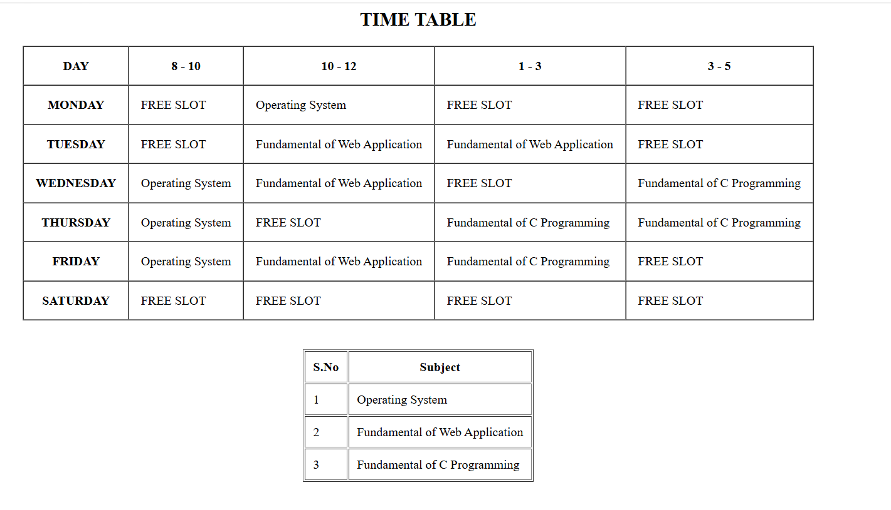

# Ex02 Time Table
## Date:

## AIM
To write a html webpage page to display your slot timetable.

## ALGORITHM
### STEP 1
Create a Django-admin Interface.

### STEP 2
Create a static folder and inert HTML code.

### STEP 3
Create a simple table using ```<table>``` tag in html.

### STEP 4
Add header row using ```<th>``` tag.

### STEP 5
Add your timetable using ```<td>``` tag.

### STEP 6
Execute the program using runserver command.

## PROGRAM
```
<html>

<head>
    <title>Time Table</title>
</head>

<body>

    <h2 align="center">TIME TABLE</h2>

    <table border="1" cellpadding="15" cellspacing="0" align="center">

        <tr>
            <th>DAY</th>
            <th>8 - 10</th>
            <th>10 - 12</th>
            <th>1 - 3</th>
            <th>3 - 5</th>
        </tr>

        <tr>
            <th>MONDAY</th>
            <td>FREE SLOT</td>
            <td>Operating System</td>
            <td>FREE SLOT</td>
            <td>FREE SLOT</td>
        </tr>

        <tr>
            <th>TUESDAY</th>
            <td>FREE SLOT</td>
            <td>Fundamental of Web Application</td>
            <td>Fundamental of Web Application</td>
            <td>FREE SLOT</td>
        </tr>

        <tr>
            <th>WEDNESDAY</th>
            <td>Operating System</td>
            <td>Fundamental of Web Application</td>
            <td>FREE SLOT</td>
            <td>Fundamental of C Programming</td>
        </tr>

        <tr>
            <th>THURSDAY</th>
            <td>Operating System</td>
            <td>FREE SLOT</td>
            <td>Fundamental of C Programming</td>
            <td>Fundamental of C Programming</td>
        </tr>

        <tr>
            <th>FRIDAY</th>
            <td>Operating System</td>
            <td>Fundamental of Web Application</td>
            <td>Fundamental of C Programming</td>
            <td>FREE SLOT</td>
        </tr>

        <tr>
            <th>SATURDAY</th>
            <td>FREE SLOT</td>
            <td>FREE SLOT</td>
            <td>FREE SLOT</td>
            <td>FREE SLOT</td>
        </tr>

    </table>

    <br><br>

    <table border="1" cellpadding="10" align="center">

        <tr>
            <th>S.No</th>
            <th>Subject</th>
        </tr>

        <tr>
            <td>1</td>
            <td>Operating System</td>
        </tr>

        <tr>
            <td>2</td>
            <td>Fundamental of Web Application</td>
        </tr>

        <tr>
            <td>3</td>
            <td>Fundamental of C Programming</td>
        </tr>

    </table>

</body>

</html>
```

## OUTPUT


## RESULT
The program for creating slot timetable using basic HTML tags is executed successfully.
